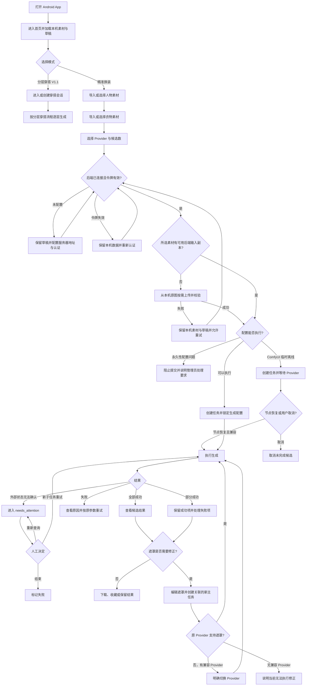
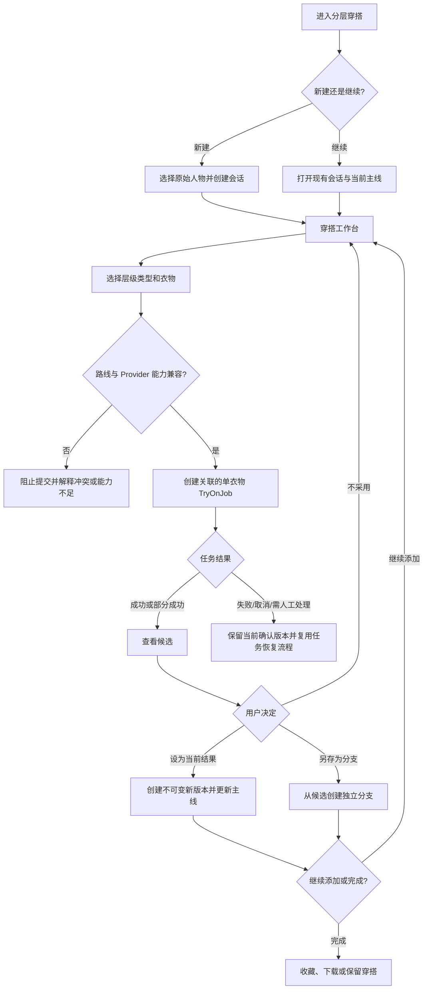
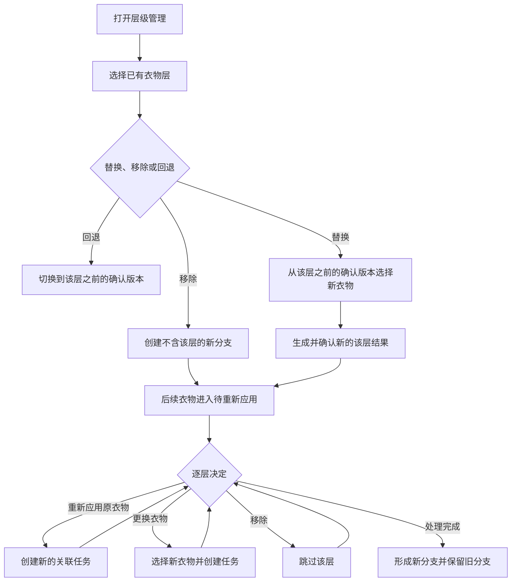
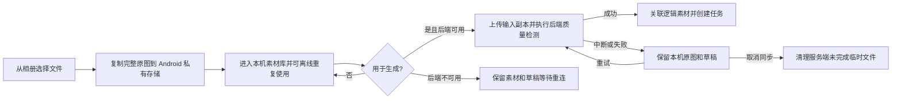
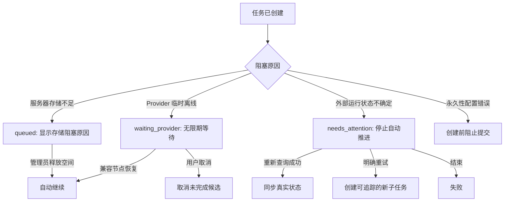
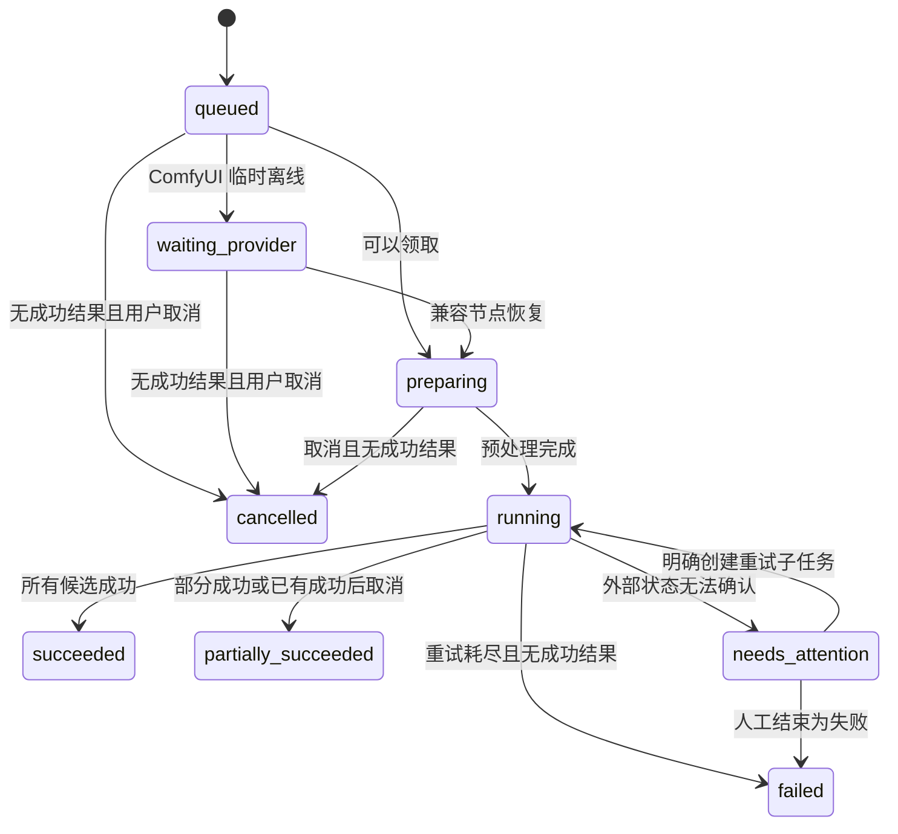

# Product Flow

## Product Overview

这是一款单用户 Android 私人 AI 换装应用。V1 支持单件精准换装；V1.1 增加可回退、可分支的分层穿搭。人物和衣物原图以 Android 私有素材库为主，可离线浏览、选择并保存草稿；生成时按需上传输入副本，通过大模型或 ComfyUI 生成 1–4 个换装候选。固定云服务器保存任务、逻辑素材记录、临时输入副本、结果和执行历史，AutoDL 仅作为可替换的 ComfyUI 计算节点。Product Spec 是行为与规则的唯一权威来源，本文只负责可视化已确认流程。

## Main Product Flow

## Major Feature Flows

### V1.1 分层穿搭

### 修改已有衣物层

分体路线允许内搭、下装和外套；连衣裙路线允许连衣裙和外套。连衣裙与内搭、下装互斥，切换路线时从原始人物图创建新分支并移除互斥层；兼容外套保留为 `pending_reapply`，由用户在新路线基础衣物确认后决定重新应用、更换或移除，不自动生成或收费。原分支保持不变。首期允许用户按需要决定实际生成步骤顺序，衣物语义层级与生成步骤顺序分别保存。

### 素材导入

### 重试与遮罩修正

- 同参数重试：在原主任务下创建新子任务，保留旧尝试、错误和费用相关记录。
- 遮罩发生改变：创建关联的新主任务，原任务和原结果保持不变。
- 新子任务完成后重新计算主任务汇总状态。
- 分层穿搭中的失败、取消或 `needs_attention` 不改变当前确认版本。只有用户选定成功候选后才提交新版本。
- 待重新应用只保存原衣物和参数引用，不自动执行；重新应用时创建新的可追踪任务。
- 重新应用时优先预填原 Provider 和参数；原配置不可用时由用户明确选择兼容 Provider，并显示和记录配置变化。没有兼容 Provider 时保留待重新应用状态，不创建任务。

### 删除

- 删除无引用的本机人物或衣物只删除设备副本，不静默删除后端副本、逻辑记录或历史。
- 未提交草稿引用的本机素材须先移除或替换；穿搭会话、分支、确认版本或待重新应用配置引用的本机素材继续适用受保护删除规则。
- 活跃任务引用的素材不能直接删除；用户须先取消任务或结束人工处理状态。
- 未删除穿搭会话、分支、确认版本或待重新应用配置引用的人物和衣物素材不能直接删除；系统列出引用，用户须先移除相关引用。
- 存在未结束任务的穿搭分支或会话不能删除；用户须先取消任务或结束人工处理状态。
- 当前主线分支不能直接删除。先切换其他分支为主线；只有一个分支时通过删除整个会话完成。
- 人物和衣物的服务端输入二进制在最后活动任务终止 24 小时后自动清理；新活动引用会取消并重启计时。
- 输入二进制清理后继续保留逻辑素材记录、任务参数、状态、错误、执行谱系和生成结果，并显示服务端副本不可用；同设备再次使用时从本机原图恢复。
- 终态任务允许确认删除生成结果图片；删除后继续保留任务参数、状态、错误和执行谱系，并显示素材已删除占位状态。

## Important Failure and Recovery Flows

素材同步与升级迁移的恢复规则：

- 后端离线、上传中断或 App 退出时，本机原图和草稿保持不变；重连后从同步步骤继续，不要求重新选择相册文件。
- 旧服务端素材只在完整下载、写入 Android 私有存储并校验成功后确认迁移完成；未确认项不得进入服务端自动清理。
- 迁移因空间不足暂停时保留服务端源文件；认证范围变化时立即停止，不能把上一所有者的素材下载到新范围。
- 后端阻断性校验失败时不创建任务；本机素材仍保留。警告性质量问题继续沿用“提示但允许提交”的规则。

## Important State Lifecycle

## Important Cross-Feature Behavior

- 任务创建时锁定 Provider 配置、模型参数和工作流版本；默认配置变化不影响等待中的任务。
- 归档 Provider 只阻止其用于新任务和默认后端选择；已创建任务继续使用锁定配置，历史引用、修订和加密凭据继续保留。当前默认 Provider 必须先切换后才能归档；恢复后回到非活动状态并重新经过验证、启用和默认选择流程。
- AutoDL 节点地址不随任务锁定。新节点通过锁定工作流的兼容性检查后，可承接等待任务。
- `waiting_provider` 不自动过期；节点恢复后继续执行，用户可随时取消。
- 未结束任务的详情持续展示可验证的当前阶段、已耗时和候选完成数；页面可见时自动刷新，返回前台时立即同步。Provider 没有可信百分比时只显示阶段式或不定进度，不推算百分比。
- 同步中断时保留最后一次已知进度并显示连接异常与最后更新时间；恢复后继续同步，不改变服务端任务状态。进入终态或 `needs_attention` 后停止活动进度动画并展示结果或恢复操作。
- 存储不足时拒绝新上传和新任务；已经持久化的任务留在 `queued`，空间恢复后自动继续。
- 取消单个候选不影响其他候选。取消整个任务后，有成功结果则汇总为 `partially_succeeded`，否则为 `cancelled`。
- App Token 失效不取消服务端任务；重新认证后同步最新状态。
- App Token 失效或后端离线不阻止浏览、筛选和选择本机素材，也不丢失草稿；仅上传、生成和服务端同步暂停。
- 人物和衣物的 Android 私有原图是导入素材的权威副本；固定后端输入二进制是可恢复的执行副本，逻辑素材记录与任务历史不随二进制清理而删除。
- 服务端输入二进制在最后活动任务终止后进入固定 24 小时宽限期；活动任务引用、未确认的旧素材迁移和宽限期内的新引用都会阻止清理。
- V1 使用单一隐式所有者范围；素材查询、迁移、下载和本机映射均保留所有者边界，以便未来账号只能访问自己上传的素材。当前不提供账号切换、云备份或跨设备同步。
- 分层穿搭的每一步复用单衣物 `TryOnJob`；会话版本与执行任务分离，旧版本和旧分支不可被新生成覆盖。
- 替换或移除中间层后，后续层进入待重新应用。用户可重新应用原衣物、更换衣物或移除，不自动连续生成。
- 分体与连衣裙路线切换时，新分支移除互斥层并保留兼容外套为待重新应用；原分支不变。
- 重新应用的原 Provider 不可用时不静默切换；用户明确选择兼容 Provider 后创建新任务，没有兼容 Provider 时保持待重新应用。
- 删除分支或会话不隐式取消任务或改变主线：未结束任务先处理，当前主线先显式切换；唯一分支只能随整个会话删除。
- 分层 Provider 必须声明顺序分层和目标层级能力；能力不足时在创建任务前阻止提交。
- 已确认人物、背景和衣物采用尽量保持策略。质量检查提示明显漂移，但不默认删除或拒绝用户可接受的结果。
- 未删除穿搭会话或分支继续操作所需的原始人物图、确认版本图片和衣物素材受引用保护，不按普通未收藏文件期限自动清理；解除最后引用后恢复普通清理规则。

## Confirmed Product Decisions

- 不确定的外部运行状态进入 `needs_attention`，禁止盲目重复执行。
- 任务锁定生成语义配置，但允许迁移到兼容的新 AutoDL 物理节点。
- 上传失败保留本地选择，并允许重试或取消。
- 导入完成即建立可离线使用的 Android 私有素材；生成提交时才按需上传未同步输入。
- 服务端自动清理人物和衣物输入二进制，但保留逻辑素材记录、历史和结果；同设备复用时从本机原图恢复。
- 当前单用户以隐式所有者范围隔离数据，并为未来显式账号所有权保留边界。
- 同参数重试属于原主任务；遮罩修改属于关联的新主任务。
- 活跃引用阻止素材删除；终态允许删除图片并保留历史占位。
- 临时离线允许排队，永久性配置问题阻止创建任务。
- 有历史引用的 Provider 使用可恢复归档而不是永久删除；只有无历史引用、非默认且非系统管理的 Provider 可以永久删除。
- `waiting_provider` 无限期保留，直到恢复或用户取消。
- 分层穿搭作为 V1.1 独立模式，不扩大 V1 必交范围。
- 首期固定内搭、外套、下装和连衣裙四类；层级定义由系统版本化维护并在创建会话时锁定，数据模型不使用四个固定字段。
- 衣物自身类别与当前穿搭中的层级角色分开保存；系统可推荐角色，但由用户在添加衣物时确认。
- 默认从一个选中候选继续，其他候选可由用户主动另存为分支。
- 穿搭版本不可变；替换中间层从前一确认版本重新生成，旧分支继续保留。
- 连衣裙与内搭、下装互斥但可搭配外套；切换路线创建新分支。
- 路线切换从原始人物图建立新分支，兼容外套只保留配置并等待用户明确重新应用，不自动产生任务或费用。
- 穿搭会话和分支依赖的生成基底与素材在引用期间不会自动过期；被穿搭版本或待重新应用配置引用的素材必须先解除引用才能删除。
- 重新应用时不静默替换失效 Provider；分支删除不隐式取消任务或自动切换当前主线。

## UI/UX Handoff

UI/UX 必须支持：

- 首次连接、令牌失效和重新认证。
- 本机素材导入、离线可用、存储占用、删除引用阻止和 App 数据清除风险。
- 按需上传进度、未同步/同步中/可用/服务端副本已清理状态、失败重试、取消和质量风险提示。
- 升级后旧服务端素材自动迁移的进度、中断续传、空间不足、认证变化和完成确认。
- 后端能力差异、临时离线排队和不可恢复配置错误。
- Provider 的活动、非活动、已归档状态，以及归档确认、默认项阻止、恢复和历史只读关联。
- `queued`、`waiting_provider`、`preparing`、`running`、`needs_attention`、成功、部分成功、失败和取消状态。
- 未结束任务的阶段式运行进度、已耗时、候选完成数、自动刷新、最后更新时间和断网后恢复；仅在 Provider 返回可信数据时显示百分比。
- 候选级取消、任务级取消、失败候选重试和执行谱系查看。
- 外部状态不确定时的重新查询、明确重试和结束操作。
- 存储不足的阻塞原因及恢复后的状态更新。
- 结果对比、下载、收藏、删除、遮罩修正和必要时切换兼容 Provider。
- 删除活跃引用时的阻止说明，以及终态图片删除后的历史占位状态。
- 删除被穿搭版本或待重新应用配置引用的素材时，展示具体引用关系和解除引用要求。
- V1.1 穿搭会话列表、穿搭工作台、当前主线、分支历史和层级管理。
- 候选“设为当前结果”和“另存为分支”，以及替换后续层的待重新应用选择。
- 层级冲突、Provider 分层能力不足和已有衣物明显漂移的可理解提示。
- 重新应用时原 Provider 失效的配置变更提示、兼容 Provider 选择和无可用 Provider 状态。
- 删除分支或会话前的未结束任务阻止状态，以及删除当前主线前的显式主线切换要求。
