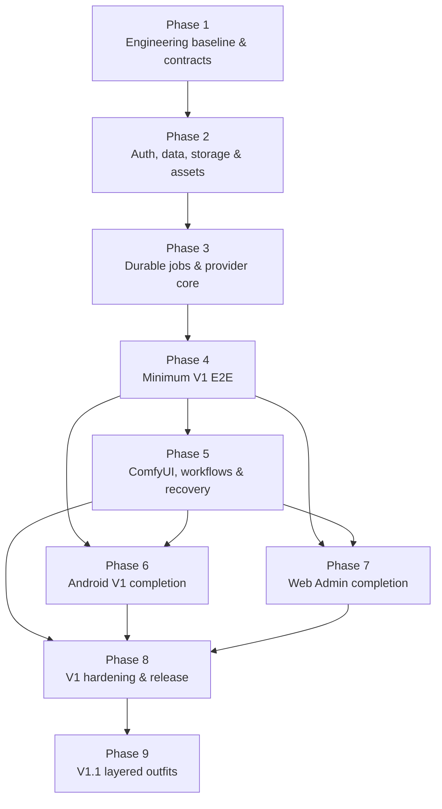

# Implementation Roadmap

## Delivery Progress

- Phase 1 — COMPLETE
- Phase 2 — COMPLETE (11 / 11 tasks; exit gate passed 2026-09-27)
- Phase 3 — COMPLETE (11 / 11 tasks; exit gate passed 2026-09-27)
- Phase 4 — COMPLETE (real Volcengine Ark vertical slice verified 2026-09-27)
- Phase 5 — COMPLETE FOR IMPLEMENTATION (10 / 10 tasks; deterministic gate passed 2026-09-28)
- Deferred release evidence — credentialed AutoDL/Comfy acceptance after a real Workflow/node exists
- Phase 6 — COMPLETE (10 / 10 tasks; exit gate passed 2026-09-28 via `android/verify-phase6.ps1`)
- Next — plan Phase 7 (Web Admin and Operations Completion) from the persisted roadmap

## Current Repository State

当前状态是“Phase 1–5 实现已完成；真实 Comfy 验收延期且不阻塞 Phase 6”：

| 区域 | 当前状态 | 可复用程度 |
|---|---|---|
| Product Spec | 已确认，实际文件为 [2026-09-23-android-virtual-try-on-design.md](../superpowers/specs/2026-09-23-android-virtual-try-on-design.md) | 产品行为、架构边界、状态机、数据模型和验收场景的权威来源 |
| Product Flow | 已确认，见 [product-flow.md](../product-flow.md) | 可直接用于 API、状态机和 E2E 测试设计 |
| Android UI Spec | 已确认，见 [2026-09-23-android-v1-ui-design.md](../superpowers/specs/2026-09-23-android-v1-ui-design.md) | 可直接转为 Compose 页面、状态与组件边界 |
| Android Prototype | 已有静态 HTML 设计画布 | 仅作视觉和交互验收参考，不是 Android 代码 |
| Web Admin UI Spec | 已确认，见 [2026-09-24-web-admin-ui-design.md](../superpowers/specs/2026-09-24-web-admin-ui-design.md) | 页面、操作、状态与响应式规则可直接实施 |
| Web Admin Prototype | [index.html](../../prototypes/web-admin-high-fi/index.html) 与 [states.html](../../prototypes/web-admin-high-fi/states.html) | 可提取 token、构图与状态参考；当前是内联 CSS/JS 静态原型 |
| Visual System | [DESIGN.md](../../DESIGN.md) 已确认 | Android/Web 共享 token 与平台规则的实现依据 |
| Repository | Git `main` 上 Phase 1–4 提交与验收证据完整 | 可从可审计的 Phase 4 基线实施 Phase 5 |
| Android 源码 | Phase 6 完成：固定导航、素材库与可恢复导入、三步向导、任务/恢复/谱系、结果与对比、下载分享、删除占位与遮罩修正已实现 | 后续仅在 V1.1 复用共享组件，不提前暴露会话/分支 |
| Backend 源码 | FastAPI、SQLite/Alembic、认证、私有存储、持久任务调度、Provider 执行平面和真实 Seedream Adapter 已存在 | Phase 5 增加 ComfyUI、Workflow 与完整恢复语义 |
| Web Admin 源码 | React 工程、Admin 登录/session 与 Seedream Provider 最小配置流程已存在 | ComfyUI/Workflow 完整控制台留在 Phase 7；Phase 5 先实现 API |
| 配置/部署 | Compose、Caddy、单实例锁、环境模板、Phase 4 部署验证与 CI 门禁已存在 | Phase 5 扩展 Comfy 节点、Workflow 和恢复验证 |
| 测试 | Contract/Backend/Web/Android/deployment 门禁及 Phase 4 真实验收已建立 | Phase 5 增加 Comfy fixture、兼容节点迁移、存储暂停与清理测试 |
| README/运维说明 | Phase 1–4 启动、验证、安全边界和真实 Ark 验收已记录 | 随 Phase 5 增补 ComfyUI/AutoDL 运维与恢复手册 |

Phase 5 直接复用共享契约、持久化/UoW、认证、私有存储、素材引用、Provider port、任务状态机和单实例调度所有权边界；不重写 Phase 1–4 基础设施。

---

## Implementation Delta

### REUSE

- Product Spec 中的模块化单体边界：`Auth / Assets / Jobs / Providers / Workflows / Admin / Cleanup`。
- 已确认的任务状态机、主任务/子任务结构、幂等和恢复规则。
- `FileStorage`、Provider、Workflow Version 等抽象边界。
- Android 的导航、Screen Inventory、共用组件边界。
- Web Admin 的 Sidebar IA、配置验证轨、诊断表格与 Inspector。
- `DESIGN.md` 中的颜色、字体、形状、状态和无障碍规则。
- 静态原型作为视觉回归基准。

### NEW

- 工程仓库、模块结构、依赖锁定、CI 和部署基线。
- API 契约、错误码、分页、幂等、能力描述和版本规则。
- SQLite schema、迁移体系、仓储层和文件引用模型。
- App/Admin 认证、Secret 加密、Admin Cookie session。
- 素材上传、恢复、质量检查、私有下载及引用保护。
- 持久任务调度器、状态机、取消、重试和重启恢复。
- LLM Provider、ComfyUI Provider、Workflow 验证和版本锁定。
- Android V1 App。
- Web Admin。
- 清理、备份、诊断、脱敏日志和完整测试体系。
- V1.1 `Outfits` 模块及 Android 独立体验。

### Implementation Delta 判断

当前不存在“旧代码与新设计不一致”的局部差异，而是生产实现整体缺失。静态 HTML 不能直接视为 Web Admin 实现；其中的演示数据、内联状态切换和原型脚本不能进入生产架构。

---

## Phase Overview

| Phase | 目标 | 主要串行依赖 |
|---|---|---|
| 1 | 建立工程与技术契约基线 | 无 |
| 2 | 建立安全、数据、文件和素材基础 | Phase 1 |
| 3 | 建立持久任务系统与 Provider 执行平面 | Phase 2 |
| 4 | 打通 V1 最小端到端闭环 | Phase 3 |
| 5 | 完成 ComfyUI、Workflow 与恢复语义 | Phase 4 |
| 6 | 完成 Android V1 产品体验 | Phase 4；部分依赖 Phase 5 |
| 7 | 完成 Web Admin 与运维控制面 | Phase 4；部分依赖 Phase 5 |
| 8 | V1 系统硬化与发布验收 | Phase 5、6、7 |
| 9 | 独立启动 V1.1 分层穿搭 | Phase 8 |

---

## Phase 1 — Engineering Baseline and Contracts

Goal:  
把已确认设计转换为可实施的工程边界，建立可构建、可测试、可部署的项目骨架。

Dependencies:  
无。

Affected:

- Repository root
- Backend、Android、Web Admin
- API contracts
- Deployment/CI
- Shared documentation

Deliverables:

- 初始化 Git 和清晰的 monorepo 结构，例如 `backend/`、`android/`、`web-admin/`、`contracts/`、`infra/`。
- 确认并记录后端语言/框架、Web 技术栈、数据库访问和迁移工具、后台调度方式等技术 ADR。
- 以 Product Spec 为依据定义首批 OpenAPI/JSON 契约：
  - authentication
  - assets/uploads
  - providers/capabilities
  - jobs/job items/outputs
  - admin configurations
- 固化任务状态、错误码、Provider 能力字段、幂等键和版本引用格式。
- 建立环境配置模板、Secret 注入边界、lint/build/test 基线。
- 明确 V1 单实例部署约束：SQLite 与进程内调度器期间禁止无协调的多副本 Worker。
- 建立设计资产进入实现的方式：Android/Web 各自 token，不共享 UI 组件代码。

Exit Criteria:

- 三个应用骨架都能在干净环境构建。
- Backend 健康端点可运行；Android/Web 可连接 mock 或 contract server。
- API 契约能表达全部 V1 状态，不需要 UI 自行发明状态。
- CI 至少执行构建、静态检查和空测试套件。
- 技术选型和单实例运行约束已记录，不留给后续阶段临时决定。

---

## Phase 2 — Trusted Data, Auth and Asset Plane

Goal:  
先建立所有任务和 Provider 都依赖的可信持久层、认证层和私有文件层。

Dependencies:  
Phase 1。

Affected:

- Backend `Auth`
- `Assets`
- `FileStorage`
- database/migrations
- Android connection/import persistence
- Admin authentication shell

Deliverables:

- SQLite 初始 schema 与迁移机制。
- App Token、Admin Token 初始化、慢哈希存储、权限隔离和轮换基础。
- Admin Token 登录后安全 Cookie session。
- 服务端主密钥下的 Provider/节点 Secret 加密设施。
- 私有磁盘 `FileStorage` 实现：
  - 原子写入
  - 内容哈希
  - MIME/尺寸校验
  - EXIF 清理与方向校正
  - 受认证下载
- `Asset / PersonAsset / GarmentAsset` 基础实体与收藏、删除占位、引用计数/引用查询。
- 可恢复上传会话与临时文件清理。
- Android 本地保存服务器地址、Token 状态和未完成导入引用。
- 存储容量阈值和“拒绝新上传/任务”的共享守卫。

Exit Criteria:

- App Token 不能调用 Admin API。
- 文件不能绕过认证从公开静态路径读取。
- 上传中断后可重试或取消；取消能清理临时文件。
- 服务重启后素材与上传状态一致。
- Secret、Token、原始图片内容不会进入日志。
- 数据库迁移测试能从空库稳定建立当前 schema。

---

## Phase 3 — Durable Job and Provider Core

Goal:  
建立 V1 的核心任务模型、持久状态机和统一生成接口。

Dependencies:  
Phase 2。

Affected:

- Backend `Jobs`
- `Providers`
- scheduler
- persistence
- job APIs
- contract tests

Deliverables:

- `TryOnJob / JobItem / GeneratedOutput` 模型。
- 创建任务的幂等语义，任务创建时锁定 Provider 配置、模型参数和 Workflow 版本。
- 数据库驱动的领取、租约/互斥、指数退避和重启恢复。
- 完整状态转换守卫：
  - `queued`
  - `waiting_provider`
  - `preparing`
  - `running`
  - `needs_attention`
  - terminal states
- 候选级取消、任务级取消、迟到结果丢弃。
- 同参数重试创建新子任务；遮罩修改预留关联新主任务语义。
- 统一 Provider port 和错误分类。
- 一个实际 LLM Adapter，或在真实供应商尚未确定时先提供契约级 fake adapter。
- 状态轮询和执行谱系 API。
- Provider contract tests 和任务状态机测试。

Exit Criteria:

- 重复创建请求不会产生重复执行。
- 后端重启能恢复 `queued` 和 `waiting_provider`。
- 无法确认的外部执行进入 `needs_attention`，不会盲目重跑。
- 候选取消不会影响其他候选。
- 重试记录不会覆盖旧尝试。
- Provider 实现可通过同一套契约测试。

---

## Phase 4 — Minimum V1 End-to-End Vertical Slice

Goal:  
尽早形成最小但真实可运行的 V1 闭环，验证整体架构，而不是等待各端“全部完成”后再集成。

Dependencies:  
Phase 3。

Affected:

- Backend
- one LLM Provider
- Android minimum flow
- Web Admin minimum configuration flow
- deployment

Deliverables:

- Web Admin：Admin 登录、创建/测试/启用一个 LLM 配置、选择默认后端。
- Android：
  - 首次连接
  - 选择并上传一张人物图
  - 选择并上传一张衣物图
  - 创建单候选任务
  - 轮询任务状态
  - 展示成功结果
- Backend：
  - 验证配置
  - 执行真实 LLM 图片生成
  - 私有保存结果
  - 返回任务及输出
- 一套本地/测试环境部署方式和可重复 smoke test。

Exit Criteria:

- 在干净部署中可以完成：初始化 Token → Admin 配置 Provider → Android 认证 → 上传两类素材 → 创建任务 → Provider 执行 → 固定服务器保存结果 → Android 查看结果。
- Android 离开任务页或重启后仍能从服务端恢复任务。
- 任务、素材和结果均有持久 ID，且文件不依赖外部 Provider 长期保存。
- 这是首个 V1 端到端里程碑，不要求此时完成 ComfyUI、遮罩编辑或全部管理页面。

---

## Phase 5 — ComfyUI, Workflow Versioning and Recovery

Goal:  
完成 V1 最复杂的执行依赖：可替换 AutoDL 节点、不可变 Workflow 版本和完整恢复语义。

Dependencies:  
Phase 4。

Affected:

- Backend `Providers/ComfyUI`
- `Workflows`
- `Jobs`
- Admin APIs
- AutoDL integration
- integration tests

Deliverables:

- 单个可替换 `ComfyNodeConfig`。
- ComfyUI 上传、队列、状态、取消、输出下载和临时文件清理。
- Workflow API JSON、manifest、bindings 和不可变版本。
- `draft → validated → active → retired` 生命周期。
- 结构验证、能力一致性检查、最小试运行、激活和回滚。
- `waiting_provider` 无限等待与兼容节点恢复。
- 节点更换时按任务锁定 Workflow 重新检查兼容性。
- 外部状态重新查询、`needs_attention` 人工重试和结束失败。
- 存储不足时暂停领取已持久化任务，恢复空间后自动继续。
- LLM/ComfyUI 相同错误语义和能力接口。

Exit Criteria:

- AutoDL 离线时可以创建并持久等待任务。
- 节点恢复后兼容任务自动继续；取消任务不会执行。
- 更换节点不会改变锁定 Workflow。
- Workflow 激活和回滚只影响新任务。
- Backend 重启或外部状态不确定不会导致重复费用。
- ComfyUI 临时文件在成功、失败、取消和迟到结果路径均被清理。

---

## Phase 6 — Android V1 Completion

Status: COMPLETE (2026-09-28; 10 / 10 tasks; exit gate `android/verify-phase6.ps1`).

Goal:  
在稳定 API 和任务语义上完成已确认的 Android V1 全部产品体验。

Dependencies:  
Phase 4；任务恢复、ComfyUI 和 Workflow 相关页面最终接入依赖 Phase 5。

Affected:

- Android navigation
- Compose design system
- local persistence
- assets
- creation wizard
- jobs/results
- mask editor
- accessibility/UI tests

Deliverables:

- `首页 / 素材 / 历史` 导航和所有 V1 Screen Inventory 页面。
- Quiet Atelier token、字体、形状、图片和状态组件。
- 素材中心、导入恢复、分类/来源修正、收藏与引用阻止。
- 三步精准换装向导。
- Provider 能力驱动的控件显示和提交检查。
- 全任务状态、候选状态、取消、部分成功、谱系和重试。
- 结果网格、Before/After、收藏、下载、删除占位。
- Mask Editor 和“修改遮罩创建关联新主任务”。
- 原 Provider 不支持遮罩时的显式兼容 Provider 切换。
- Token 失效后的重新认证和服务端状态同步。
- 无障碍、字体缩放、窄屏及进程恢复。

Exit Criteria:

- Android UI Spec 的 V1 主闭环、恢复闭环和安全一致性检查全部通过。
- 不存在静默 Provider 切换。
- `waiting_provider`、`needs_attention`、部分成功和失败具有不同语义和操作。
- App 重启后未完成导入和服务端任务都能恢复。
- V1 UI 不暴露会话、分支或衣物层，但共用组件未写死只能服务精准换装。

---

## Phase 7 — Web Admin and Operations Completion

Goal:  
完成 Quiet Control Room 管理端与后端运维控制面。

Dependencies:  
Phase 4；Workflow、ComfyUI 和恢复操作最终接入依赖 Phase 5。

Affected:

- Web Admin
- Backend `Admin`
- `Cleanup`
- diagnostics
- runtime configuration
- security

Deliverables:

- 全部 A00–A12 页面和确认的 Sidebar IA。
- 系统概览及真实/快照/局部失败状态。
- ComfyUI 节点验证轨。
- Workflow 列表、上传绑定向导、详情、激活和回滚。
- LLM Provider 列表、配置、能力检查、Secret 覆盖更新和最小生成测试。
- 独立默认后端页面。
- 高密度任务诊断表格与 Inspector。
- 存储容量、保留期限、扫描、手动清理和调度恢复。
- App Token 一次性轮换流程。
- 后端离线、会话失效、未保存更改、危险确认和一次性 Secret 状态。
- 管理操作审计元数据和脱敏诊断。

Exit Criteria:

- 保存、验证、启用、激活和设为默认保持独立动作。
- 管理页面不能修改历史任务锁定配置。
- API Key、节点凭据和 Token 不被回显。
- 所有危险操作准确说明删除什么、保留什么、如何恢复。
- 约 1050px 和 820px 的确认适配规则通过视觉及键盘检查。
- 静态原型中的八个顶级页面均有真实数据和真实操作实现。

---

## Phase 8 — V1 Hardening and Release Gate

Goal:  
以 Product Spec 的 V1 验收场景为发布标准，验证跨端安全、恢复和运维能力。

Dependencies:  
Phase 5、6、7。

Affected:

- all V1 modules
- deployment
- backup/restore
- security
- observability
- test suites
- runbooks

Deliverables:

- Backend 单元、迁移、Provider contract、清理和引用保护测试。
- Android 单元、Compose UI、进程恢复和网络恢复测试。
- Web Admin 关键配置、危险操作和会话恢复测试。
- Android → Backend → LLM/AutoDL → Storage 全链路测试。
- 节点离线、后端重启、重复请求、限流、磁盘不足和迟到结果故障注入。
- HTTPS、Secret 管理、日志脱敏、未授权下载和权限越界检查。
- 数据库与文件一致备份/恢复流程。
- 部署、Token 初始化、Provider 配置、Workflow 发布和事故恢复 runbook。

Exit Criteria:

- Product Spec 的 V1 验收场景 1–22 全部通过。
- 不以 V1.1 场景 23–37 阻塞 V1 发布。
- 真实验收环境至少有一个支持手动遮罩的 Provider。
- 已确认恢复路径不会重复执行、重复扣费或丢失成功结果。
- 运维人员可以从空部署配置出可用系统，并能完成节点更换与 Workflow 回滚。

---

## Phase 9 — V1.1 Layered Outfit Track

Goal:  
在 V1 稳定发布后，以独立领域模块和独立 Android 入口实现分层穿搭，避免提前污染 V1。

Dependencies:  
Phase 8 V1 release gate。

Affected:

- Backend `Outfits`
- Jobs optional outfit context
- Layer definitions
- asset reference graph
- Android V1.1 session/workbench UI
- tests/migrations

Deliverables:

- `OutfitSession / OutfitRevision / OutfitLayer / LayerTypeDefinition`。
- 不可变版本树、分支、主线和层级定义版本锁定。
- `applied / pending_reapply` 及替换、移除、回退、路线切换。
- 分层任务所需完整上下文和 Provider 能力检查。
- Android 会话列表、工作台、分支历史、层级管理和候选确认。
- 穿搭引用参与文件保护和清理。
- 在不破坏普通 `TryOnJob` 的前提下增加可选 outfit context。
- V1.1 专用迁移、单元、UI 和 E2E 测试。

Exit Criteria:

- Product Spec 验收场景 23–37 全部通过。
- V1 精准换装 API、历史和 UI 回归通过。
- 分层失败、取消或 `needs_attention` 不改变当前确认版本。
- 修改中间层不会自动重新生成后续层或产生费用。
- V1.1 表和页面可以独立演进，不要求修改 V1 核心导航。

---

## Dependency Graph

必须串行：

- 数据、认证、文件基础必须先于真实任务执行。
- 任务持久化和 Provider 抽象必须先于端到端闭环。
- V1.1 必须在 V1 release gate 后开始。

关键 Integration Points：

- OpenAPI 与错误码。
- Provider capabilities。
- Job/JobItem 状态转换。
- 配置与 Workflow 版本锁定。
- 文件 ID、引用保护和认证下载。
- Admin session 与 Secret 覆盖更新。
- Android 本地恢复状态与服务端权威状态。

---

## Parallelizable Work

Phase 1 完成契约后可以并行：

- Backend 数据模型与基础设施。
- Android 设计系统、导航壳和 mock 页面。
- Web Admin 设计系统、Sidebar、表格和表单壳。
- CI、部署模板和测试夹具。

Phase 4 之后可以并行：

- Backend ComfyUI/Workflow 实现。
- Android 素材、向导、任务和结果页面接入。
- Web Admin 配置与诊断页面接入。
- 测试团队建立故障注入和 E2E 环境。

并行限制：

- Android 与 Web 不得各自定义任务状态或错误语义。
- Provider 能力字段只能由共享契约定义。
- Workflow 激活、默认后端和任务锁定配置必须共用后端事务语义。
- 清理实现必须等待完整引用图确定，不能仅按文件年龄删除。

---

## Integration Strategy

- 采用 contract-first 集成：Backend 拥有正式 API schema，Android/Web 按同一契约生成或验证模型。
- 每个 Phase 都保持可部署，避免长期存在三个无法联调的孤立应用。
- Provider 使用统一 contract test suite，LLM 与 ComfyUI 只在适配器内部处理协议差异。
- 任务状态只由后端持久状态机决定；客户端负责呈现和发出明确命令。
- 文件操作与数据库变更使用“先临时写入、事务登记、提交后原子发布/补偿清理”的一致性策略。
- 所有外部执行都持有内部 JobItem ID、外部 execution ID 和可追踪 attempt。
- V1.1 只提前保留扩展安全性，不提前创建穿搭页面或把会话概念塞进 V1：
  - `person_asset_ids` 保持列表结构。
  - mode 和 capability 可扩展。
  - 引用查询不写死只有任务。
  - 真正的 `Outfits` 表、API 和 UI 到 Phase 9 再加入。

---

## Risks / Migration

- Phase 1–2 已形成可审计 Git 历史；后续仍需配置远端和托管 CI/分支保护。
- SQLite + 进程内调度要求 V1 单实例执行；错误地水平扩展会导致重复领取。
- 外部 Provider 是否支持取消、状态查询和幂等差异很大，必须保守映射到统一语义。
- ComfyUI Workflow 的“声明能力”不能只信管理员输入，需结构验证与真实试运行。
- 数据库与私有磁盘存在双写一致性风险，需要孤立文件扫描和补偿清理。
- `running` 任务在进程崩溃后的外部状态对账是重复费用风险最高的路径。
- Android 未完成导入涉及系统 URI 持久权限、临时副本及进程死亡恢复。
- Secret、原始图片和 Provider 请求正文具有高敏感性，日志默认必须拒绝记录。
- 静态原型包含演示 CSS/JS 和假数据；直接转成生产代码会固化错误状态管理方式。
- 首次 schema 也必须通过迁移工具创建，不能因为“没有旧数据”而跳过迁移纪律。
- PostgreSQL、Redis、独立 Worker 和多 Comfy 节点保持后续演进，不提前进入 V1。

---

## Upstream Conflicts

未发现需要修改 Product Spec、Product Flow、UI Spec 或 `DESIGN.md` 才能实现的冲突。

存在三项实施输入，但它们属于技术/部署准备，不是 `Upstream Conflict`：

- V1 实际使用的 LLM 厂商协议、测试凭据和费用可接受的测试方式。
- ComfyUI API Workflow JSON、自定义节点/模型清单及无敏感内容的测试素材。
- 固定云服务器、域名、HTTPS、磁盘容量和备份目标。

这些输入应在对应 Provider/部署工作开始前准备；缺失时可使用 fake adapter 推进契约和客户端开发，但不能通过 fake 验收 V1。

---

## Recommended Current Phase

Phase 4 已完成并通过带凭据的人工验收（2026-09-27）：Web Admin 写入并验证真实 Ark Key、启用并设为默认，Android 上传两类素材并完成一条单候选任务，输出经固定后端私有持久化并在 Android 显示，后端重启后仍可恢复。实现依据见 [Phase 4 Plan](../plans/phase-4-minimum-v1-e2e.md)、[ADR-0008](../../docs/adr/0008-durable-job-execution.md) 与 [ADR-0009](../../docs/adr/0009-synchronous-provider-completion.md)。

Phase 5 的 10 个实现任务和确定性退出门禁已完成，见 [Phase 5 Plan](../plans/phase-5-comfyui-workflow-recovery.md)。由于真实 Workflow 与 AutoDL/Comfy 节点尚未准备，凭据化操作员验收按 2026-09-28 的产品负责人决定延期到下一版发布准备阶段；在该证据完成前不得声称 Comfy 生产就绪。Phase 6 的 10 个实现任务与出口门禁已完成，见 [Phase 6 Plan](../plans/phase-6-android-v1-completion.md)：Android V1 的固定导航、素材库与可恢复导入、三步精确换装向导、任务/候选状态与恢复、结果对比/收藏/下载分享/删除占位、以及遮罩修正关联任务均已实现；为此新增了启用私有 `mask` 素材与关联任务的 Backend 前向迁移。出口门禁由 `android/verify-phase6.ps1` 确定性执行。下一步回到 `$planning` 规划 Phase 7（Web Admin 与运维完善）。
