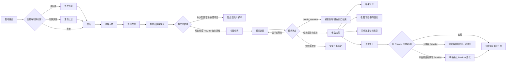

# Android 私人 AI 换装应用 V1 UI 设计

日期：2026-09-23  
状态：UI Flow、Screen Inventory 与关键页面原型已确认  
范围：Android V1 单件精准换装；为 V1.1 分层穿搭预留导航和组件边界

## 1. 设计目标

V1 UI 的首要目标是让用户清楚、快速地完成一次单件精准换装，同时能理解并恢复生成过程中的长期等待、部分失败、外部状态不确定和认证失效等状态。

成功标准：

- 从首页到任务提交的主路径只有“选择人物 → 选择衣物 → 生成设置”三个明确步骤。
- 素材只需上传一次，后续任务可重复选择。
- 任务离开当前页面后继续执行，用户能从首页或历史恢复查看。
- Provider 暂时离线、永久配置错误、存储不足和 `needs_attention` 在视觉及操作上明确区分。
- 成功候选始终优先保留，部分失败只影响对应候选。
- 同参数重试、遮罩修正和 Provider 切换的任务边界对用户可见。
- V1 不暴露穿搭会话、分支或衣物层概念，但共用 UI 组件可被 V1.1 直接复用。

## 2. 设计范围

### 2.1 本轮包含

- 全局导航与 V1 UI Flow。
- V1 Screen Inventory。
- 首次连接、首页、三步创建流程、任务详情、候选结果和遮罩修正的中保真原型。
- 任务状态映射、失败恢复、取消和删除规则。
- V1.1 导航入口及共用组件边界。
- 原型验收重点与 Android UI 测试范围。

### 2.2 本轮不包含

- Jetpack Compose 产品代码和完整 App 实现。
- V1.1 穿搭会话列表、工作台、分支历史及层级管理页面。
- Web 管理页 UI。
- 创意写真页面。
- 品牌插画、最终摄影素材和逐像素视觉交付。

## 3. 信息架构与导航

采用“任务导向”信息架构。

底部导航固定为：

1. `首页`：模式入口和最近任务。
2. `素材`：人物与衣物素材管理。
3. `历史`：全部任务及其最终状态。

“精准换装”是 V1 首页主入口。V1.1 的“分层穿搭”以并列模式卡片出现，V1 阶段标记“即将开放”；未来点击后进入独立的穿搭会话列表与工作台，不新增底部导航项。创意写真同样作为低强调占位入口，不进入 V1 流程。

创建精准换装采用全屏三步向导，不作为底部导航项。任务、结果、遮罩编辑和素材详情都是从主导航页面进入的详情层。

## 4. V1 UI Flow

### 4.1 恢复原则

- 上传失败保留本地选择和已填写元数据，允许继续上传或放弃。
- App Token 失效时保留服务器地址，只要求更新令牌；服务端任务不取消。
- ComfyUI 临时离线时允许创建任务并进入 `waiting_provider`。
- 永久配置错误和已知能力不足在提交前阻止创建任务。
- 外部运行状态无法确认时进入 `needs_attention`，停止自动推进。
- App 重启、切换网络或重新认证后，以服务端状态为准恢复任务。

## 5. Screen Inventory

### 5.1 系统与首页

| ID | 页面或状态 | 目的 | 原型优先级 |
|---|---|---|---|
| S01 | 启动路由 | 检查服务器配置和令牌状态 | 支撑 |
| S02 | 首次连接 | 配置服务器地址、App Token 并验证 | P0 |
| S03 | 重新认证 | 保留服务器地址并更新失效令牌 | P0 状态 |
| S04 | 首页 | 精准换装入口、最近任务和 V1.1 扩展位 | P0 |

### 5.2 素材

| ID | 页面或状态 | 目的 | 原型优先级 |
|---|---|---|---|
| S05 | 素材中心 | 人物与衣物分段管理、导入入口 | P1 |
| S06 | 素材选择器 | 创建任务内复用人物或衣物 | P0 组件 |
| S07 | 导入确认 | 预览、类别或来源修正、质量提示 | P1 |
| S08 | 上传进度与恢复 | 展示进度，失败后重试或取消 | P1 状态 |
| S09 | 素材详情 | 收藏、质量、引用、删除及阻止说明 | P1 |

### 5.3 创建精准换装

| ID | 页面或状态 | 目的 | 原型优先级 |
|---|---|---|---|
| S10 | 选择人物 | 复用或导入人物，展示输入质量风险 | P0 |
| S11 | 选择衣物 | 按类别筛选并说明实验性来源 | P0 |
| S12 | 生成设置与确认 | Provider、候选数、能力和任务摘要 | P0 |
| S13 | 提交阻止状态 | 永久配置错误、存储不足或能力不足 | P0 状态 |

### 5.4 任务与恢复

| ID | 页面或状态 | 目的 | 原型优先级 |
|---|---|---|---|
| S14 | 任务详情 | 总体状态、候选状态、原因和取消操作 | P0 |
| S15 | 需人工处理 | 重新查询、创建重试或结束失败 | P0 状态 |
| S16 | 部分成功 | 保留成功候选并单独处理失败项 | P0 状态 |
| S17 | 执行谱系 | 查看主任务、子任务、重试及配置版本 | P1 |

### 5.5 结果与修正

| ID | 页面或状态 | 目的 | 原型优先级 |
|---|---|---|---|
| S18 | 候选结果 | 浏览成功候选并处理失败候选 | P0 |
| S19 | 结果对比 | 原图与结果拖动对比、查看风险 | P0 |
| S20 | 遮罩编辑器 | 补画、擦除、撤销和范围预览 | P0 |
| S21 | 兼容 Provider 选择 | 原 Provider 不支持遮罩时明确切换 | P0 状态 |

### 5.6 历史与设置

| ID | 页面或状态 | 目的 | 原型优先级 |
|---|---|---|---|
| S22 | 任务历史 | 查看全部状态和已删除图片占位 | P0 |
| S23 | 连接设置 | 查看服务器、重连与同步状态 | P1 |
| X01 | 分层穿搭入口 | V1.1 模式扩展位 | 仅预留 |
| X02 | 共用组件边界 | 为 V1.1 复用素材、任务和结果组件 | 架构要求 |

## 6. 关键页面设计

### 6.1 首次连接与重新认证

首次连接页包含服务器地址、App Token、连接验证和安全说明。验证成功后才保存并进入首页。

重新认证复用相同页面结构，但服务器地址只读，主操作改为“验证新令牌”。页面明确说明服务端已有任务仍会继续运行，认证成功后将同步最新状态。

连接错误应按原因区分：地址格式错误、HTTPS/网络不可达、服务器身份不匹配和令牌无效。错误显示在对应字段或提交区域，不使用仅有“连接失败”的笼统提示。

### 6.2 首页

首页按以下视觉顺序排列：

1. 精准换装主卡片。
2. “开始换装”主操作。
3. 分层穿搭与创意写真低强调入口。
4. 最近任务列表。
5. 固定底部导航。

最近任务最多显示少量高价值记录，并同时展示任务状态、候选数量或进度。用户点击任务后进入统一任务详情。

### 6.3 三步创建流程

#### 选择人物

- 单选，但选择器的数据接口使用列表结构。
- 首项提供“从相册导入”。
- 选中素材后展示针对当前衣物目标可理解的质量提示。
- 质量风险默认不阻止继续，除非后端明确声明输入不可用。

#### 选择衣物

- 提供全部、上衣、下装和连衣裙分类筛选。
- 显示衣物来源；他人穿着图始终标记“实验性”。
- 实验性说明应靠近所选素材，不只放在帮助页面。

#### 生成设置与确认

- 展示人物和衣物摘要。
- 默认使用系统默认 Provider，允许任务级覆盖。
- 候选数为 1–4，默认 1。
- 只显示 Provider 实际支持的选项。
- 提交前显示输入质量风险、Provider 能力和配置检查结果。
- 提交时说明会锁定 Provider 配置、模型参数和工作流版本。

创建流程中的已选素材和设置在当前会话内自动保留。返回上一步不会清除后续仍兼容的选项。若用户离开创建流程，普通选择可作为短期草稿恢复；尚未完成的本地导入必须按产品规则跨 App 重启恢复。

### 6.4 任务详情

所有非终态任务复用一个详情骨架：

- 顶部显示用户可理解的总体状态。
- 中部显示等待原因、已等待或已运行时间，以及是否允许离开页面。
- 候选列表显示每个候选的独立状态和可用取消操作。
- 底部根据状态显示任务级操作。
- 技术配置和执行谱系默认折叠，用户需要时展开。

`needs_attention` 不使用普通失败样式。它必须说明自动推进已停止，并同时提供：

1. 重新查询外部状态。
2. 创建新的可追踪重试子任务。
3. 结束为失败。

### 6.5 候选结果

候选结果页以成功结果网格为主。失败或取消的候选作为列表项保留在成功结果之后，不占用结果图片的主要展示空间。

所选候选可执行：

- 查看大图。
- 与原图拖动对比。
- 收藏。
- 下载。
- 删除图片。
- 同参数重试。
- 修正遮罩。

质量检查提示贴近对应候选显示，并允许用户继续接受结果。

### 6.6 遮罩修正

编辑器提供画笔、擦除、画笔大小、撤销和遮罩预览。提交区域必须同时说明：

- 遮罩已改变，因此会创建关联的新主任务。
- 原任务和原结果不会被覆盖。
- 若 Provider 发生变化，显示原 Provider、新 Provider 和变化原因。
- 没有兼容 Provider 时保留编辑内容，不创建任务，并说明当前无法执行。

## 7. 任务状态到 UI 的映射

| 状态 | 用户文案重点 | 页面操作 |
|---|---|---|
| `queued` | 任务已保存并等待调度；存储阻塞时追加具体原因 | 取消未完成候选或整个任务 |
| `waiting_provider` | Provider 暂时离线、已等待时长、恢复后自动继续 | 取消、查看原因 |
| `preparing` | 正在上传或预处理 | 尽力取消 |
| `running` | 正在生成、候选级状态和运行时间 | 候选级取消、任务级取消 |
| `needs_attention` | 外部状态无法确认，自动推进已停止 | 重新查询、明确重试、结束失败 |
| `succeeded` | 全部候选成功 | 查看和管理结果 |
| `partially_succeeded` | 成功结果已保留，部分候选失败或取消 | 查看成功项、重试失败项 |
| `failed` | 无成功结果，显示失败原因和原参数 | 原参数重试、查看谱系 |
| `cancelled` | 无成功结果且任务已取消 | 查看历史 |

颜色只用于辅助识别，状态始终同时使用文字、图形标记和操作说明。

## 8. 异常、取消与删除

### 8.1 Provider 与配置

- `waiting_provider` 是等待状态，不显示为失败，也不显示虚假预计完成时间。
- 永久配置错误在创建页阻止提交，并明确要求管理员处理。
- 不允许静默切换 Provider。
- 存储不足时，新上传和新任务在提交前阻止；已持久化任务留在 `queued` 并显示阻塞原因。

### 8.2 取消

- 每个未完成候选均可单独取消。
- 任务级取消必须说明已成功候选将被保留。
- 取消后若已有成功结果，任务汇总为部分成功；否则为已取消。
- 终态任务不再显示“取消”，只允许管理图片和历史。

### 8.3 删除

- 删除操作只在确实会移除数据时使用确认弹窗。
- 活跃任务引用的素材禁止删除，并列出引用它的任务。
- V1.1 后续在同一引用列表中增加会话、分支、确认版本和待重新应用配置。
- 删除终态图片时明确说明：仅删除图片，不删除任务参数、错误和执行谱系。
- 删除后原图片位置显示“素材已删除”占位，不让历史结构塌陷或产生误解。

## 9. 结果任务边界

- 同参数重试：在原主任务下创建新子任务。
- 修改遮罩：创建关联的新主任务。
- Provider 或参数变化：提交前显式展示并记录在新任务中。
- 原任务、旧尝试、错误和配置版本不可被新执行覆盖。

UI 中使用“再次尝试”和“修正后重新生成”两个不同动词，避免把两种操作混为一谈。

## 10. 视觉与组件原则

### 10.1 视觉方向

- 使用 Material 3 的交互和无障碍骨架。
- 使用低饱和紫作为生成相关主色，保持私人、安静、偏时尚编辑感。
- 图片是页面主内容；装饰元素不得与素材和结果争夺注意力。
- 状态文字优先于无标签图标。
- 卡片只用于模式入口、素材、任务和结果等可操作实体，避免把普通说明全部卡片化。
- 风险提示使用温和警示色，阻断错误使用更强的错误色。

### 10.2 共用组件

- `AssetPicker`：人物与衣物的单选、导入和风险提示。
- `GenerationSettings`：Provider、候选数、能力及配置检查。
- `JobStatusPanel`：任务状态、原因、等待时间和操作。
- `CandidateGallery`：成功候选、失败项、质量风险和结果操作。
- `BeforeAfterCompare`：原图与结果拖动对比。
- `MaskEditor`：遮罩绘制、擦除、撤销和预览。
- `ExecutionLineage`：主任务、子任务和关联任务关系。
- `ReferenceBlocker`：删除阻止及具体引用列表。

## 11. V1.1 扩展边界

V1.1 不改变底部导航。首页“分层穿搭”模式卡片在开放后进入独立会话列表，随后进入穿搭工作台。

V1.1 复用以下 V1 组件：

- 人物和衣物素材选择。
- Provider 与候选数设置。
- 任务详情和全部任务状态。
- 候选结果与质量风险。
- 执行谱系。
- 引用阻止和删除说明。

V1 组件不得把以下假设写死：

- 每个任务都来自精准换装首页。
- 结果只能作为独立图片使用。
- 衣物只有素材类别而没有未来的层级角色。
- 引用关系只可能来自任务。

穿搭会话、分支、层级角色、确认版本和待重新应用是 V1.1 独立页面与领域状态，不提前暴露在 V1 用户界面中。

## 12. 无障碍与 Android 适配

- 所有主要触控目标至少满足 48 dp。
- 状态、风险和选择不能只通过颜色表达。
- 图片按钮具有可朗读标签，例如“收藏候选 2”。
- 动态任务更新使用适度的可访问性播报，避免每次进度变化都打断用户。
- 支持系统字体缩放；重要操作和状态文案不得截断。
- 结果网格在窄屏和大字体下可退化为单列。
- 遮罩编辑器保留明确的撤销、当前工具和画笔大小文本状态。
- 返回手势与顶栏返回行为一致；破坏性编辑离开前提示未提交更改。

## 13. 原型验收与测试重点

### 13.1 主闭环

- 首次连接成功进入首页。
- 从首页完成选择人物、选择衣物和生成设置。
- 提交后进入任务详情，离开页面再返回时状态正确。
- 成功任务进入候选结果并完成对比、收藏和下载。

### 13.2 恢复闭环

- 上传中断后保留本地选择，可重试或取消。
- App 重启后未完成导入仍可恢复。
- ComfyUI 离线任务进入 `waiting_provider`，恢复后继续。
- App Token 失效后保留地址，重新认证后同步任务。
- `needs_attention` 不自动重复执行，三个操作均具有正确后果。
- 部分成功任务保留成功项，只重试失败候选。

### 13.3 安全与一致性

- 候选级取消不影响其他候选。
- 任务级取消正确汇总为部分成功或已取消。
- 活跃引用阻止素材删除并列出引用。
- 终态图片删除后仍保留历史占位和执行谱系。
- 修改遮罩创建关联新主任务。
- Provider 变化必须在提交前明确展示；无兼容 Provider 时不创建任务。

## 14. 已确认原型

浏览器设计画布保存在：

`/.superpowers/brainstorm/v1-ui-20260923/content/`

其中：

- `navigation-approaches.html`：导航方案对比。
- `v1-flow-and-inventory.html`：V1 UI Flow 与 Screen Inventory。
- `core-prototypes-v1.html`：8 个核心页面中保真原型。
- `states-recovery-and-rules.html`：状态、恢复、结果边界和 V1.1 复用规则。

这些文件是设计讨论与原型记录，不是 Android 产品代码。
