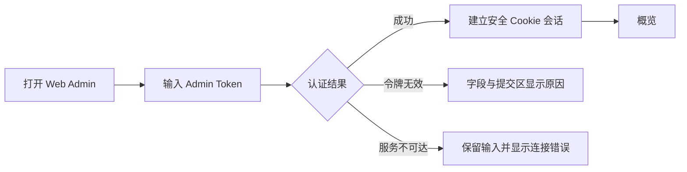
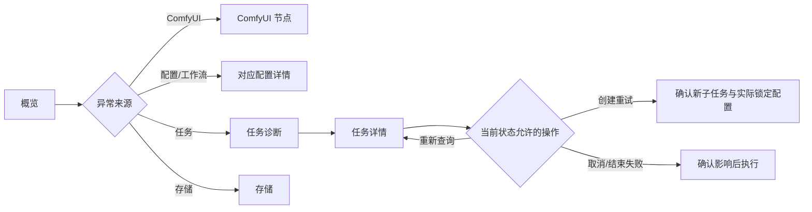
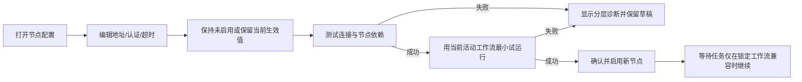
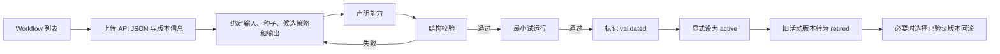
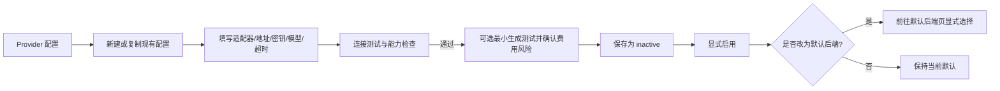
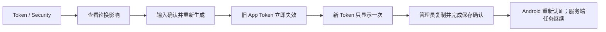

# Web Admin UI Spec

日期：2026-09-24  
状态：Admin UX 与 Visual Direction 已确认；完整 Web Admin UI 设计已完成  
范围：Web 管理端的信息架构、导航、UI Flow、Screen Inventory、页面职责、关键状态与恢复流程

## 1. 阶段与权威来源

本文件只定义 Web Admin 的 UX 结构和中保真交互，不定义最终视觉系统，也不涉及实现架构。

- 产品行为以 `2026-09-23-android-virtual-try-on-design.md`（已确认 Product Spec）为权威来源。
- `product-flow.md` 用于核对任务、Provider、存储和恢复流程。
- Android UI Spec 与已确认 Android Prototype 只提供共享状态语义、视觉气质和交互边界，不提供 Web 导航结构。
- `DESIGN.md` 当前记录 Android 的 Quiet Atelier 视觉系统。本阶段不修改它；Web 视觉方向确认后再区分跨平台规则与 Web-specific 规则。

## 2. 已确认的管理能力与边界

### 2.1 首版确实存在的能力

1. 查看业务服务、数据库、存储和 ComfyUI 连通性。
2. 维护一个可更换的 ComfyUI 计算节点：地址、认证、超时、启用状态、连接测试和工作流试运行。
3. 管理不可原地覆盖的 ComfyUI 工作流版本：上传、绑定、结构校验、最小试运行、验证、启用、停用和回滚。
4. 维护大模型连接：适配器、API 地址、覆盖更新 API Key、模型、超时、厂商参数、能力检查、连接测试和最小生成测试。
5. 显式选择全局默认后端。
6. 诊断任务队列、失败原因和外部执行状态，并执行符合任务状态的取消、重新查询、可追踪重试或结束失败。
7. 查看空间占用、配置保留期限并执行手动清理。
8. 轮换 App Token；新值只显示一次。
9. 使用 Admin Token 登录；登录后由安全、HttpOnly、SameSite Cookie 维持会话。

### 2.2 不在首版 Web Admin 中增加

- 多 ComfyUI 节点列表、负载均衡、节点池或调度权重。
- 用户、角色、组织、注册、计费或运营后台。
- Admin Token 的网页轮换；丢失时必须通过服务器 SSH 重置。
- 数据库路径、文件根目录、服务端主密钥、监听地址、日志级别等部署级配置编辑。
- 日志全文浏览、审计日志导航页、通知中心、成本报表或模型市场。
- 直接修改历史任务锁定的 Provider、模型参数或工作流版本。

## 3. Admin Information Architecture

Web Admin 采用“状态优先、对象配置、运行维护”三层信息架构。

```text
Web Admin
├── 概览
│   └── 系统状态与当前阻塞
├── 配置
│   ├── ComfyUI 节点
│   ├── Workflows
│   ├── LLM Provider
│   └── 默认后端
└── 运行维护
    ├── 任务诊断
    ├── 存储
    └── Token / Security
```

结构原则：

- 概览回答“系统现在能否正常接收并执行任务”。
- 配置页回答“生成基础设施和默认选择是什么”。
- 运行维护页回答“当前有哪些异常、如何安全恢复、哪些数据可清理”。
- 不把配置表单、状态表格和危险操作混在一个 dashboard 中。
- 不新增独立的“错误中心”；错误落在其责任对象和任务诊断中，概览只汇总并深链到来源。

## 4. Navigation Structure

### 4.1 桌面主导航

使用持久左侧 Sidebar；顶部栏只承载当前页面标题、环境/连接状态和当前会话操作，不重复主导航。

Sidebar 顺序：

1. `概览`
2. 分组 `配置`
   - `ComfyUI 节点`
   - `Workflows`
   - `LLM Provider`
   - `默认后端`
3. 分组 `运行维护`
   - `任务诊断`
   - `存储`
   - `Token / Security`

导航状态：

- 当前页面使用位置、文字强调和左侧标记共同表达，不仅依赖颜色。
- 分组标题不可点击；首版项目数量不足以支持折叠菜单，避免增加隐藏层级。
- 侧栏在较窄桌面宽度可收窄为图标 + tooltip，但配置向导和诊断详情不迁移为移动端 Bottom Sheet。
- 页面内对象关系使用链接和面包屑；例如任务详情可跳转到其锁定的 Provider 配置和 Workflow 版本。

### 4.2 全局状态区

顶部栏显示：

- 后端会话是否在线。
- 数据是否为实时状态或最近一次成功快照。
- 退出管理会话。

不在顶部栏加入全局搜索、通知铃铛或快速创建；Product Spec 没有对应能力。

## 5. Admin UI Flow

### 5.1 登录与进入



### 5.2 日常观察与诊断



### 5.3 ComfyUI 节点更换



### 5.4 Workflow 发布与回滚



### 5.5 LLM Provider 配置



### 5.6 App Token 轮换



## 6. Screen Inventory

| ID | 页面 / 状态 | 类型 | 主要职责 |
|---|---|---|---|
| A00 | Admin 登录 | 独立入口 | 验证 Admin Token，建立安全会话，区分无效令牌与服务不可达 |
| A01 | 系统概览 | 顶级页面 | 汇总四项系统健康、队列阻塞与需处理事项，并深链到责任页 |
| A02 | ComfyUI 节点 | 配置详情 | 维护单个可替换节点，测试连接、检查依赖、试运行、启用或停用 |
| A03 | Workflow 列表 | 配置列表 | 按用途展示不可变版本、状态、验证结果和当前活动版本 |
| A04 | Workflow 上传与绑定 | 向导 | 上传 API JSON，绑定节点字段，声明能力并执行结构校验 |
| A05 | Workflow 版本详情 | 配置详情 | 查看绑定、能力来源、验证/试运行结果，执行启用、停用或回滚 |
| A06 | LLM Provider 列表 | 配置列表 | 展示保存的配置版本及 inactive/active 状态；一次仅一个活动连接 |
| A07 | LLM Provider 配置详情 | 表单详情 | 覆盖更新密钥，测试连接、计算能力、运行最小生成测试并显式启用 |
| A08 | 默认后端 | 简单配置 | 在当前可用后端中显式选择全局默认，并解释只影响新任务 |
| A09 | 任务诊断 | 密集表格 | 查看队列、状态、阻塞、失败原因和锁定配置；进入任务详情 |
| A10 | 任务诊断详情 | 分栏详情 | 查看子任务、外部执行、错误、谱系及状态允许的恢复操作 |
| A11 | 存储管理 | 运维页面 | 查看容量与受保护/可清理数据，维护保留期限并执行手动清理 |
| A12 | Token / Security | 安全页面 | 查看 App Token 标识与轮换时间，轮换 App Token；说明 Admin Token 的 SSH 恢复边界 |
| X01 | 全局离线 / 会话失效 | 全局状态 | 保留当前阅读上下文，停止写操作，允许重连或重新登录 |
| X02 | 敏感值一次性显示 | 模态流程 | 仅在生成后显示完整 App Token；离开后不可再次查看 |
| X03 | 危险操作确认 | 模态流程 | 明确对象、影响、新旧配置边界与不可恢复后果 |

## 7. 页面主要职责与内容层级

### A01 系统概览

首屏只回答三个问题：

1. 系统是否能接收新上传和新任务？
2. 已有任务是否能继续调度？
3. 管理员现在是否需要采取行动？

内容顺序：

- 结论条：`正常 / 受限 / 需要处理`，附最近刷新时间。
- 四项依赖状态：业务服务、数据库、存储、ComfyUI。
- 运行阻塞：`waiting_provider`、存储阻塞 `queued`、`needs_attention` 和配置故障数量。
- 需要处理列表：每项链接到任务、节点、工作流或存储责任页。
- 当前生效摘要：默认后端、活动 LLM 配置、活动 Workflow 版本。

概览不复制完整配置表单，不放危险操作。

### A02 ComfyUI 节点

- 当前生效配置与连接健康状态分开显示，避免“表单看起来正确”等同于“节点可用”。
- 认证字段只显示已配置/未配置和覆盖入口，不回显原值。
- 测试结果区分网络/认证、ComfyUI API、模型/自定义节点、活动工作流兼容性。
- 启用前必须让管理员看到连接测试和最小试运行结果。
- 节点停用或更换时说明：新任务的 ComfyUI 可用性、等待任务的兼容性检查，以及不会改写任务锁定的 Workflow 版本。

### A03–A05 Workflows

- 列表以 `workflow_id + mode` 为稳定分组，版本作为行；不把版本伪装成可覆盖文件。
- 状态固定为 `draft / validated / active / retired`。
- 能力显示来源：结构可验证、试运行验证或人工声明。
- 绑定向导使用持续可见的节点/字段映射表，不使用移动端逐项 Sheet。
- 激活前显示影响：只影响之后创建的新任务；已创建任务保持锁定版本。
- 回滚是把已验证旧版本重新设为 active，不恢复或重写历史任务。

### A06–A07 LLM Provider

- 列表保留旧配置以支持检查和回退，但一次只允许一个活动大模型连接。
- 表单按“身份与协议 / 连接 / 密钥 / 模型与厂商参数 / 超时 / 能力”分区。
- API Key 为覆盖更新：空值表示保留已保存密钥；界面不得伪造可读原值。
- 连接测试与最小生成测试分开；后者提交前提示可能产生费用。
- 保存默认为 inactive；启用和设为默认是两个独立动作。
- 非系统管理 Provider 提供可恢复归档；归档前说明其只停止新任务使用，历史、修订和密钥继续保留。默认 Provider 由服务端阻止归档并要求先切换。
- 已归档 Provider 继续出现在管理列表的“已归档”状态中，详情只读并提供恢复；恢复后回到 inactive，须重新验证和启用。永久删除保持独立危险操作，已有任务引用时仍由服务端拒绝。

### A08 默认后端

- 展示当前默认和可选后端的可用性、配置版本、关键能力摘要。
- 不可用或未验证的配置不能被选择，并在原位说明原因。
- 更改只影响新任务；等待中、运行中和 `needs_attention` 任务继续使用其锁定配置。
- 保存 Provider 或 Workflow 时不得隐式改变此页选择。

### A09–A10 任务诊断

- 表格优先，不使用卡片网格。首屏列：任务 ID、模式、状态、创建时间/等待时长、锁定 Provider、锁定 Workflow、阻塞或失败摘要。
- 状态筛选至少覆盖 Product Spec 的完整任务状态；另提供“需要管理员处理”聚合视图，但不创造新的任务状态。
- 详情使用同页右侧分栏或独立详情路由；宽屏优先分栏以保留列表上下文。
- 详情按“当前结论 → 候选子任务 → 外部执行 → 锁定配置 → 错误与谱系”排序。
- 操作由状态决定：
  - `queued / waiting_provider / preparing / running`：按规则取消未完成范围。
  - `needs_attention`：重新查询、创建可追踪重试子任务、结束为失败。
  - `failed / partially_succeeded`：只对失败候选按原参数创建新子任务。
  - 终态不显示取消。
- 不允许把重新提交显示为原外部执行“继续”，也不允许静默换用当前默认配置。

### A11 存储管理

- 容量区分总量、已用、可用和“已进入阻断阈值”结论；不以单一百分比替代结论。
- 数据分类至少表达受收藏保护、受活跃任务/穿搭引用保护、已到期可清理、AutoDL 临时副本。
- 保留期限配置只覆盖 Product Spec 允许配置的未收藏结果、中间遮罩和预处理文件。
- 手动清理先展示作用范围和不能清理的受保护引用，再执行不可撤销确认。
- 清理成功或释放空间后，显示调度恢复状态；已因空间不足入队的任务自动继续，不要求管理员逐个重试。

### A12 Token / Security

- 只显示 App Token 的标识、创建/轮换时间与状态，不显示完整现值。
- 轮换确认明确：旧 Token 立即失效、Android 需要重新认证、服务端已有任务不取消。
- 新 Token 只显示一次；关闭前要求管理员确认已保存，但不把“复制”当作已经安全保存的证明。
- Admin Token 仅说明当前会话与 SSH 重置方法，不提供网页轮换控件。

## 8. 页面之间的重要关系

| 来源 | 目标 | 关系 |
|---|---|---|
| 概览异常 | 节点 / Workflow / Provider / 任务 / 存储 | 从症状进入责任对象，不在概览直接修复 |
| ComfyUI 节点 | 活动 Workflow | 节点启用前用当前活动工作流试运行；等待任务还需按锁定版本检查兼容性 |
| Workflow 版本 | ComfyUI 节点 | 验证和回滚均依赖当前节点具备模型、自定义节点和输入输出兼容性 |
| LLM Provider | 默认后端 | Provider 启用后仍需在默认后端页显式选择 |
| 默认后端 | 新任务 | 只决定之后创建任务的默认选择，不改写已有任务 |
| 任务详情 | Provider / Workflow | 只读查看实际锁定版本；不得从详情直接改写历史锁定配置 |
| 存储 | 任务调度 | 空间不足阻止新任务并暂停领取已入队任务；空间恢复后自动继续 |
| App Token 轮换 | Android 认证 | 旧 Token 立即失效；服务端任务继续，Android 更新 Token 后同步 |

## 9. 关键状态、错误与恢复

### 9.1 全局读取状态

| 状态 | UI 行为 | 恢复 |
|---|---|---|
| 初次加载 | 保留页面结构的中性骨架，不显示健康结论 | 成功后替换为真实状态 |
| 单模块加载失败 | 该区显示具体失败与重试，不让整个页面假装离线 | 重试该模块；其他已加载区域保持可用 |
| 后端离线 | 顶部持久横幅；最后快照标注时间；所有写操作停用 | 自动重连或手动重试 |
| 会话失效 | 保留当前目标 URL，进入重新登录 | 登录成功后回到原页面并重新拉取服务端状态 |
| 无数据 | 说明为什么为空以及下一步；不使用庆祝式空状态 | 进入对应配置创建流程 |

### 9.2 配置状态

- 未保存表单与当前生效值必须可区分；离开有未保存修改时提示。
- 测试失败不覆盖当前已生效配置；草稿保留以便修正。
- 保存成功不等于启用成功；`inactive / validated / active / retired` 等状态必须显式显示。
- 敏感字段错误只说明认证或格式问题，不回显服务端收到的密钥内容。
- 外部原始错误只以脱敏诊断展示，不显示完整请求、令牌、API Key 或原图。

### 9.3 任务状态语义

- `waiting_provider` 是可恢复等待，不使用失败语义，不显示虚假 ETA。
- 存储阻塞的 `queued` 仍是已持久化任务；恢复空间后自动继续。
- `needs_attention` 是停止自动推进的决策状态，不能合并到普通 failed。
- 配置故障停止自动重试，并在任务详情链接到责任配置页。
- 部分成功保留成功输出，只处理失败候选。
- 取消运行任务为尽力而为；迟到结果不进入历史并被清理。

## 10. 危险操作与恢复边界

| 操作 | 风险提示 | 确认后果 | 可恢复方式 |
|---|---|---|---|
| 停用/更换 ComfyUI 节点 | 新 ComfyUI 任务可能等待；等待任务仍需锁定工作流兼容检查 | 不改写历史锁定配置 | 修复并重新启用兼容节点 |
| 激活/回滚 Workflow | 新任务将使用另一版本 | 已创建任务不变；旧活动版本保留为 retired | 将已验证旧版本再次设为 active |
| 启用 LLM 配置 | 新任务可选择该连接，测试可能产生费用 | 不自动成为默认 | 停用或重新启用上一配置 |
| 更改默认后端 | 新任务默认选择改变 | 已有任务不变 | 再次选择原默认 |
| 取消任务/候选 | 运行中取消可能无法中止远端计算；已有成功候选保留 | 无成功则 cancelled，有成功则 partially_succeeded | 终态后通过新子任务重试，不能撤销原取消记录 |
| `needs_attention` 重试 | 会创建新的执行与可能费用 | 生成可追踪新子任务，不冒充原执行继续 | 保留原记录；新子任务可按其状态处理 |
| 结束为失败 | 停止该任务的自动推进 | 保留历史、错误和谱系 | 后续仅能创建新重试，不改写原终态 |
| 手动清理 | 文件删除不可恢复，受引用文件必须跳过 | 删除符合策略的实际文件 | 无文件级撤销；历史元数据和删除占位按规则保留 |
| 轮换 App Token | Android 立即失去旧令牌权限 | 旧 Token 立即失效；新值只显示一次 | Android 输入新 Token；Admin Token 不受影响 |

## 11. Mid-Fi Prototype 说明

本阶段原型用于验证：

- Sidebar 分组和页面可发现性。
- 概览是否能从“结论 → 责任对象”完成分流。
- Workflow 与 Provider 的“草稿/测试/启用”边界是否清楚。
- 任务诊断的表格密度、列表上下文和详情层级。
- 危险操作是否准确说明影响与恢复边界。

原型故意不确定最终字体、精确色值、形状、深度和品牌装饰。它沿用共享状态语义，但不应被当作最终 Web 视觉方向。

## 12. 已确认的 Admin UX 约束

以下 Admin UX 决策已于 2026-09-24 确认：

1. 采用 `概览 / 配置 / 运行维护` 的 Sidebar 分组，并保持八个首版能力为可直接到达的页面。
2. 单个 ComfyUI 节点使用配置详情页，而不是伪造多节点列表。
3. Workflow 和 Provider 使用“列表 + 详情/向导”；默认后端独立成页，任何保存动作都不隐式改变默认值。
4. 任务诊断采用密集表格 + 同页右侧详情（窄宽度退化为独立详情页）。
5. 危险操作遵循“影响预览 → 明确确认 → 页面内结果/恢复入口”，且不承诺 Product Spec 未定义的撤销能力。

后续视觉设计以这些结构为约束；除非视觉设计阶段发现明确的 UX 冲突，否则不重新设计。Visual Direction 确认前不更新 `DESIGN.md`，不扩展全部页面的高保真，也不实现代码。

## 13. Confirmed Visual Application

Web Admin 使用已确认的 `Quiet Control Room / 安静的控制室` 方向。稳定的共享与 Web-specific 规则已进入根目录 `DESIGN.md`；本节只记录页面如何使用这些规则。

### 13.1 全局框架

- 232px 深色 Sidebar 固定承载已确认的信息架构；窄桌面收为约 64px icon rail。
- 顶栏只显示路径、实时/快照状态和管理会话。
- 页面标题区较疏，使用衬线总体结论或对象标题；进入内容后切换为无衬线高密度工作区。
- 主内容使用暖纸面、规则线和分栏组织，不使用通用 Dashboard 卡片阵列。

### 13.2 系统概览

- 总体结论是第一视觉锚点；依赖状态、阻塞数量和存储结论形成横向 verdict strip。
- 四项系统依赖使用 ledger rows，不使用四张彩色健康卡。
- 需要处理事项用窄状态轨排序，并深链到责任页面。
- 当前默认后端、活动模型和活动 Workflow 以低强调配置带收尾，不与异常争夺注意力。

### 13.3 ComfyUI 节点

- 当前生效配置、编辑草稿和实时健康结论明确分层。
- 连接测试、节点依赖和活动 Workflow 试运行按顺序形成 verification rail。
- 节点离线使用琥珀等待语义；启用/停用影响说明贴近动作区。
- Secret 只显示配置状态与覆盖入口。

### 13.4 Workflows

- 列表按稳定 `workflow_id + mode` 分组，版本作为高密度行；状态列固定显示 `draft / validated / active / retired`。
- 选中版本在右侧 Inspector 显示绑定、能力来源、结构校验和试运行结果。
- 上传与绑定使用桌面分步向导：JSON → 节点字段映射 → 能力声明 → 结构校验 → 最小试运行。
- 激活与回滚使用影响确认，明确只影响新任务。

### 13.5 LLM Provider

- Provider 列表与版本详情共享“对象列表 + 右侧/独立详情”语言。
- 配置详情采用分区介绍列、字段列和 verification rail。
- API Key 只允许覆盖更新；连接测试和最小生成测试分开表达。
- `inactive / active` 使用文字和形状标记；保存、验证、启用、设为默认保持独立动作。

### 13.6 默认后端

- 使用两条可比较的后端选择行，展示可用性、配置版本和能力摘要。
- 不可用后端保留在列表中并原位解释原因，不能只置灰。
- 保存区持续说明“只影响新任务”。

### 13.7 任务诊断

- 使用高密度表格、紧凑筛选工具条和右侧 Inspector。
- 选中行使用左侧 plum 轨与 tonal wash；状态使用标记 + 文字，不依赖 badge 颜色。
- Inspector 顺序固定为当前结论、候选、锁定配置、外部执行、错误与谱系、状态允许的操作。
- `needs_attention` 使用独立琥珀决策面板；重试和结束失败的影响在操作前持续可见。

### 13.8 存储

- 容量结论、已用/可用和可清理数量先以数字与规则线表达，再进入数据分类 ledger。
- 受引用保护、收藏长期保留和到期可清理使用稳定语义，不把整个区域染色。
- 手动清理先显示扫描结果、跳过的受保护引用和不可恢复后果，再进入确认。

### 13.9 Token / Security

- App Token 使用标识、状态和轮换时间，不显示完整现值。
- 轮换动作独立置于危险区，先解释旧 Token 立即失效与 Android 重新认证影响。
- 新 Token 在高层级 Dialog 中只显示一次；关闭前确认已保存。
- Admin Token 以只读运维说明表达 SSH 重置边界，不出现网页轮换控件。

## 14. Important State Treatments

- `loading`：保持页面骨架和真实布局，不提前显示健康结论。
- `empty`：在责任区域内说明缺少什么和唯一下一步，不使用庆祝插画。
- `module error`：只替换失败模块；其他已加载内容继续可用。
- `backend offline`：顶部持久横幅显示最后快照时间，全部写操作停止。
- `session expired`：保留目标路径，重新登录成功后返回并刷新服务端状态。
- `unsaved changes`：字段差异与当前生效版本可见；离开前确认。
- `secret one-time`：完整值只存在于创建后 Dialog；关闭后不可重开。
- `danger confirmation`：按照影响说明、明确确认、结果与恢复入口三段式呈现。

## 15. Confirmed Prototypes

- `prototypes/web-admin-high-fi/index.html`：完整 Web Admin 高保真交互原型。包含八个顶级页面、Provider 详情、Workflow 上传/回滚、ComfyUI 停用、存储清理、Token 轮换、会话失效、登录错误和全局离线恢复。
- `prototypes/web-admin-high-fi/states.html`：状态与恢复视觉参考。集中展示加载、空、局部错误、最后快照、重新认证、危险确认、一次性 Secret 和未保存配置/测试失败。

`index.html` 的 URL hash 可直接定位主要页面：`#overview`、`#comfy`、`#workflows`、`#provider-list`、`#default`、`#diagnostics`、`#storage`、`#security`。

原型用于设计交付，不是 Web 产品实现代码。

## 16. Final Admin UI Review

### 16.1 Product and UX fidelity

- PASS：八类首版管理能力均有对应页面；未增加多节点负载均衡、用户管理、审计中心或部署级配置编辑。
- PASS：Sidebar、单 ComfyUI 节点、列表 + 详情/向导、任务表格 + Inspector 和危险操作三段式保持已确认结构。
- PASS：默认后端、Provider 启用和 Workflow 激活仍是独立动作；已有任务锁定配置不被视觉流程误导为可改写。

### 16.2 Visual system

- PASS：Android 与 Web 共享品牌、色彩、排版方向、状态和形状家族，但 Web 未复制 Bottom Navigation、Bottom Sheet 或移动端 Card 结构。
- PASS：Overview、Configuration、Operations 通过不同密度和构图表达职责，同时保持同一套 Quiet Control Room 语言。
- PASS：表格、表单、Secret、verification rail、Inspector、状态和危险操作均有稳定可复用规则。
- PASS：界面身份不依赖色彩；灰度下仍可由 Sidebar、规则线、排版、状态轨和主从分栏识别。

### 16.3 Accessibility and adaptation

- PASS：状态与选择不只依赖颜色；关键操作始终有文字标签和可见 focus。
- PASS：约 1050px 收窄 Sidebar；820px 及以下将配置验证轨、对象 Inspector 和状态案例改为单列顺序。已在 1440px 与 800px 实际检查。
- PASS：离线、会话失效、加载、空、错误、一次性 Secret 和危险确认状态已定义。
- PASS：动画可 reduced-motion；等待状态不使用持续旋转或虚假 ETA。

### 16.4 Handoff readiness

Android UI、Web Admin UI 和后续 implementation planning 可以从 Product Spec、各自 UI Spec、Confirmed Prototypes 与 `DESIGN.md` 复现产品视觉语言，无需自行发明关键设计决策。

UI 设计阶段到此停止，不进入实现或 implementation planning。

## 17. UI Design Completion Gate

- PASS：所有 implementation-relevant 页面均有页面级构图、密度、状态和交互指导。
- PASS：加载、空、局部错误、全局离线、会话失效、未保存修改、测试失败、危险确认与一次性 Secret 均有恢复边界。
- PASS：`DESIGN.md` 已固化最终 Web Admin 视觉规则，并明确跨平台共享规则与 Android / Web 平台特定规则。
- PASS：桌面与 800px 窄宽度均有可查看原型，并保持信息顺序、操作边界和状态语义一致。
- PASS：后续 implementation planning 无需自行发明重要 UI/UX 决策。

未解决的重要 UI 决策：无。

`WEB ADMIN UI DESIGN COMPLETE`
